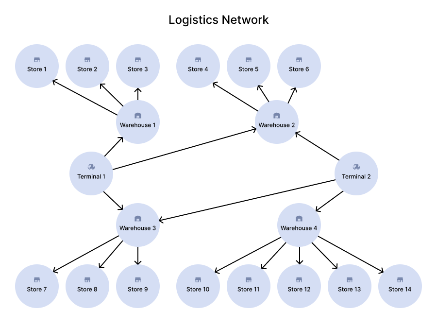

<p align="center">
  
</p>

#### [# goit-algo2-hw-04](https://github.com/topics/goit-algo2-hw-04) <!-- omit in toc -->

## Maximum Flow and Trie prefix tree implementations in Python. <!-- omit in toc -->

This project covers two independent algorithmic problems:

* **[Edmonds-Karp algorithm](https://en.wikipedia.org/wiki/Edmonds%E2%80%93Karp_algorithm)** - modeling a logistics network and finding the maximum goods flow from terminals to stores.
* **[Trie prefix tree](https://en.wikipedia.org/wiki/Trie)** - extending the Trie data structure with suffix search and prefix existence check methods.

## Table of Contents <!-- omit in toc -->
- [Requirements](#requirements)
  - [Task 1: Maximum Flow for Goods Logistics](#task-1-maximum-flow-for-goods-logistics)
    - [Description](#description)
    - [Technical Requirements](#technical-requirements)
    - [Acceptance Criteria](#acceptance-criteria)
  - [Task 2: Extending Trie Functionality](#task-2-extending-trie-functionality)
    - [Description](#description-1)
    - [Technical Requirements](#technical-requirements-1)
    - [Acceptance Criteria](#acceptance-criteria-1)
- [Tasks Solution](#tasks-solution)
  - [Task 1](#task-1)
    - [Algorithm](#algorithm)
    - [Results](#results)
    - [Analysis](#analysis)
  - [Task 2](#task-2)
    - [Implementation](#implementation)
- [Project Setup \& Run Instructions](#project-setup--run-instructions)
  - [Prerequisites](#prerequisites)
  - [Setting Up the Development Environment](#setting-up-the-development-environment)
    - [Clone the Repository](#clone-the-repository)
  - [Run the code](#run-the-code)
    - [Run code locally](#run-code-locally)
      - [For Linux and macOS:](#for-linux-and-macos)
      - [For Windows:](#for-windows)
- [License](#license)

## Requirements

### Task 1: Maximum Flow for Goods Logistics

#### Description

Develop a program to model a goods flow network from terminals to stores using the maximum flow algorithm. Build a graph matching the following logistics network structure with 20 nodes and given edge capacities, apply the Edmonds-Karp algorithm to find the maximum flow, and produce an analysis report.

<p align="center">
  
</p>

Network edges and capacities:

| From | To | Capacity (units) |
|------|----|-----------------|
| Terminal 1 | Warehouse 1 | 25 |
| Terminal 1 | Warehouse 2 | 20 |
| Terminal 1 | Warehouse 3 | 15 |
| Terminal 2 | Warehouse 3 | 15 |
| Terminal 2 | Warehouse 4 | 30 |
| Terminal 2 | Warehouse 2 | 10 |
| Warehouse 1 | Store 1 | 15 |
| Warehouse 1 | Store 2 | 10 |
| Warehouse 1 | Store 3 | 20 |
| Warehouse 2 | Store 4 | 15 |
| Warehouse 2 | Store 5 | 10 |
| Warehouse 2 | Store 6 | 25 |
| Warehouse 3 | Store 7 | 20 |
| Warehouse 3 | Store 8 | 15 |
| Warehouse 3 | Store 9 | 10 |
| Warehouse 4 | Store 10 | 20 |
| Warehouse 4 | Store 11 | 10 |
| Warehouse 4 | Store 12 | 15 |
| Warehouse 4 | Store 13 | 5 |
| Warehouse 4 | Store 14 | 10 |

#### Technical Requirements

1. Use the Edmonds-Karp algorithm for maximum flow calculation.
2. The graph must match the described structure with 20 nodes and given capacities.

#### Acceptance Criteria

1. The program correctly calculates the maximum flow and returns accurate results.
2. Data is correctly added to the graph and matches the logistics network structure.
3. Explanations and analysis clearly reflect the logic of the algorithm.
4. The report includes analysis of the obtained results.

### Task 2: Extending Trie Functionality

#### Description

Implement two additional methods for the `Trie` class:

* `count_words_with_suffix(pattern)` - count the number of words ending with the given pattern.
* `has_prefix(prefix)` - check whether any word with the given prefix exists.

#### Technical Requirements

* The `Homework` class must inherit from the base `Trie` class.
* Methods must handle invalid input data.
* Input parameters of both methods must be strings.
* `count_words_with_suffix` must return an integer.
* `has_prefix` must return a boolean value.

#### Acceptance Criteria

1. `count_words_with_suffix` returns the count of words ending with the given pattern. Returns 0 if no words match. Case-sensitive.
2. `has_prefix` returns `True` if at least one word with the given prefix exists, `False` otherwise. Case-sensitive.
3. Code passes all tests.
4. Invalid input data is handled.
5. Methods work efficiently on large datasets.

## Tasks Solution

### Task 1

The solution is located in [src/task1/task1.py](src/task1/task1.py).

#### Algorithm

The network is represented as a directed graph with weighted edges (capacities). Since there are two source terminals, a virtual **super source** node is added and connected to both terminals with unlimited capacity. Similarly, a virtual **super sink** is connected from all stores. This reduces the multi-source problem to a standard single-source, single-sink maximum flow problem.

The **Edmonds-Karp algorithm** (a BFS-based implementation of Ford-Fulkerson) repeatedly finds the shortest augmenting path from source to sink using BFS, pushes flow along that path up to the bottleneck capacity, and updates residual capacities (including reverse edges to allow flow rerouting). This continues until no augmenting path exists.

#### Results

Maximum flow achieved: **115 units**

Flow distribution between terminals and stores (computed via Edmonds-Karp):

| Terminal | Store | Actual Flow (units) |
|----------|-------|-------------------|
| Terminal 1 | Store 1 | 15 |
| Terminal 1 | Store 2 | 10 |
| Terminal 1 | Store 3 | 0 |
| Terminal 1 | Store 4 | 10 |
| Terminal 1 | Store 5 | 6.67 |
| Terminal 1 | Store 6 | 3.33 |
| Terminal 1 | Store 7 | 10 |
| Terminal 1 | Store 8 | 5 |
| Terminal 1 | Store 9 | 0 |
| Terminal 1 | Store 10 | 0 |
| Terminal 1 | Store 11 | 0 |
| Terminal 1 | Store 12 | 0 |
| Terminal 1 | Store 13 | 0 |
| Terminal 1 | Store 14 | 0 |
| Terminal 2 | Store 1 | 0 |
| Terminal 2 | Store 2 | 0 |
| Terminal 2 | Store 3 | 0 |
| Terminal 2 | Store 4 | 5 |
| Terminal 2 | Store 5 | 3.33 |
| Terminal 2 | Store 6 | 1.67 |
| Terminal 2 | Store 7 | 10 |
| Terminal 2 | Store 8 | 5 |
| Terminal 2 | Store 9 | 0 |
| Terminal 2 | Store 10 | 20 |
| Terminal 2 | Store 11 | 10 |
| Terminal 2 | Store 12 | 0 |
| Terminal 2 | Store 13 | 0 |
| Terminal 2 | Store 14 | 0 |

[terminal screenshot](./assets/task1/max-flow.png)

#### Analysis

**1. Which terminals provide the highest flow?**

Terminal 1 delivers **60 units** (via Warehouses 1, 2, 3), Terminal 2 delivers **55 units** (via Warehouses 2, 3, 4). Terminal 1 has a higher total output capacity and provides the larger share of the flow.

**2. Which routes have the lowest capacity and how does it affect overall flow?**

The lowest-capacity routes are Terminal 2 -> Warehouse 2 (10 units) and Warehouse 4 -> Store 13 (5 units). These limits restrict flow on individual paths, but since the true bottleneck is at the terminal output level, expanding these routes alone would not increase total throughput.

**3. Which stores received the least goods and can their supply be increased?**

Stores 3, 9, 12, 13, and 14 receive **0 units**. This happens because their connected warehouses are already at full capacity serving other stores. To supply these stores, terminal output capacity would need to be increased first - expanding only the warehouse-to-store routes would not help while terminal output remains the bottleneck.

**4. Are there bottlenecks that can be eliminated to improve network efficiency?**

The total terminal output capacity is **115 units** (Terminal 1: 60, Terminal 2: 55), while the total store input capacity is **200 units**. The network already achieves its theoretical maximum of 115 units. The bottleneck is entirely at the terminal output level - increasing warehouse-to-store capacities would have no effect. To improve throughput, terminal output capacity must be expanded.

[results analysis screenshot](./assets/task1/results-analysis.png)

### Task 2

The solution is located in [src/task2/homework.py](src/task2/homework.py). The base `Trie` class is copied from the course materials into [src/task2/trie.py](src/task2/trie.py).

#### Implementation

The `Homework` class inherits from `Trie` and adds two methods:

**`count_words_with_suffix(pattern)`** collects all words stored in the trie via `keys()` and counts how many end with the given pattern using the built-in `str.endswith()` method. Returns an integer; returns 0 if no words match. Case-sensitive.

**`has_prefix(prefix)`** walks the trie node-by-node following each character of the prefix. If all characters are found, at least one word with that prefix exists and the method returns `True`. If any character is missing, returns `False`. Case-sensitive. Runs in O(k) time where k is the prefix length, without collecting all words.

Both methods raise `TypeError` on non-string input.


## Project Setup & Run Instructions

### Prerequisites

* Python 3.10 or later
* Git (optional, for cloning)

### Setting Up the Development Environment

#### Clone the Repository

```bash
git clone https://github.com/oleksandr-romashko/goit-algo2-hw-04.git
cd goit-algo2-hw-04
```

### Run the code

#### Run code locally

##### For Linux and macOS:

```bash
python3 src/task1/task1.py
python3 src/task2/homework.py
```

##### For Windows:

```bash
python src\task1\task1.py
python src\task2\homework.py
```

## License

This project is licensed under the [MIT License](./LICENSE).
